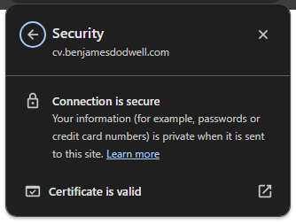

Before I begin with the technical work, I want to quickly cover terminology. This project is named The Cloud Resume Challenge but the word resume is less commonly used in the United Kingdom when compared to Curriculum Vitae or CV. There is a [difference](https://www.grammarly.com/blog/cv-resume/) in that a resume should be a summary of relevant experience and skills tailored towards a specific job, whereas a CV is more academically focused and usually a complete history. Resume is probably the more appropriate description of the document that I intend to publish with this project, but nevertheless they are treated almost interchangeably in my country so I will use CV as the more popular term.

The reason that terminology is suddenly important, is that I am at a point where I want to configure a custom domain to access my S3 static website. The website endpoint generated for the AWS bucket will be something like bucket-name-here.s3-website.eu-west-2.amazonaws.com which is hard to remember and doesn't look great.

I have registered benjamesdodwell.com and would like to use a subdomain, such as cv.benjamesdodwell.com for this project. Namecheap are the registrar and they provide an email forwarding service that I would like to continue using, but I would also like to use AWS Route 53 to manage DNS for this project. So, my plan is leave Namecheap managing the root domain but create name server (NS) DNS records for the cv subdomain.

The first step is to create a public hosted zone in Route 53 for cv.benjamesdodwell.com. This automatically creates start of authority (SOA) and name server (NS) records, and the values of these NS records can then be used for the cv subdomain on Namecheap. Once the records propagate, I'll have the split control that I'm looking for.
```
nslookup -q=ns benjamesdodwell.com
Server:  one.one.one.one
Address:  1.1.1.1

Non-authoritative answer:
benjamesdodwell.com     nameserver = dns1.registrar-servers.com
benjamesdodwell.com     nameserver = dns2.registrar-servers.com

nslookup -q=ns cv.benjamesdodwell.com
Server:  one.one.one.one
Address:  1.1.1.1

Non-authoritative answer:
cv.benjamesdodwell.com  nameserver = ns-1254.awsdns-28.org
cv.benjamesdodwell.com  nameserver = ns-1861.awsdns-40.co.uk
cv.benjamesdodwell.com  nameserver = ns-234.awsdns-29.com
cv.benjamesdodwell.com  nameserver = ns-926.awsdns-51.net
```

At this stage, I could create an alias (A) record in Route 53 for the cv.benjamesdodwell.com alias to the S3 bucket static website endpoint. However, the static website is still using HTTP and I'd rather use HTTPS as a security best-practice so, to avoid rework, I will deal with this next and revisit the DNS records at the end.

In order to enable HTTPS, I will need a certificate, and it seems that [AWS Certificate Manager (ACM)](https://docs.aws.amazon.com/Route53/latest/DeveloperGuide/getting-started-cloudfront-overview.html#getting-started-cloudfront-request-certificate) can issue them for free to be used with integrated services such as CloudFront and Elastic Load Balancing.


CloudFront is a content delivery network (CDN) service that is perhaps primarily used to cache content and distribute globally via edge locations that may be more geographically appropriate, which can improve speeds for the consumer. There are other features available, however, such as a web application firewall (WAF) which is probably unnecessary for a static website. CloudFront can also attach a [custom certificate](https://docs.aws.amazon.com/Route53/latest/DeveloperGuide/getting-started-cloudfront-overview.html#getting-started-cloudfront-distribution) and redirect HTTP requests to HTTPS which is the main functionality that I'm looking for in this project.


Finally, we can revisit DNS and [route traffic to our CloudFront distribution endpoint](https://docs.aws.amazon.com/Route53/latest/DeveloperGuide/getting-started-cloudfront-overview.html#getting-started-cloudfront-create-alias) via our custom domain by creating an A record.



I have been particularly impressed with the level of integration between AWS services, through these stages of the project. ACM can automatically create Route 53 records to support domain validation during a certificate request. CloudFront will populate origin endpoints to a dropdown and similarly with custom certificates during configuration of a distribution. Route 53 will populate endpoints for an alias into a dropdown. This functionality may sound obvious or mundane, but this level of integration rarely exists with on-premises infrastructure and would typically involve a lot of disjointed manual work which increases the risk of misconfiguration.

Next time, I will start to look at some back-end features.
