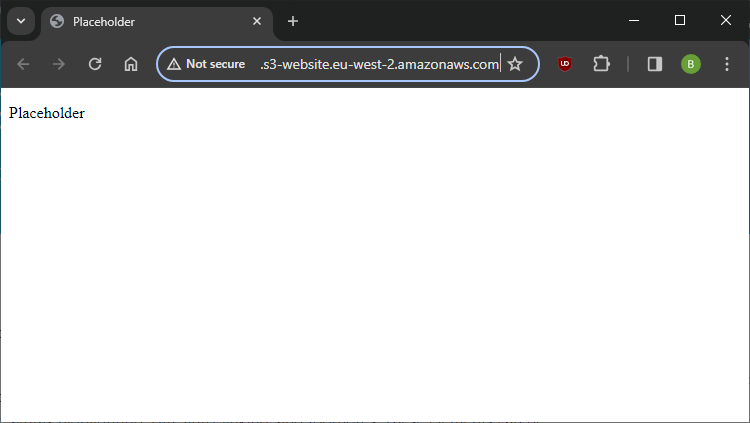

The first step towards hosting a static website is creating a Simple Storage Service (S3) bucket. It's crucial to consider [bucket naming rules](https://docs.aws.amazon.com/AmazonS3/latest/userguide/bucketnamingrules.html?icmpid=docs_amazons3_console), with the key point being that the name must be globally unique.

I anticipate that I will be primarily using the AWS console to familiarise myself with the services and options. However, I aim to transition towards [Terraform](https://www.terraform.io/) and Infrastructure as Code (IaC) techniques later.

After configuring [static website hosting](https://docs.aws.amazon.com/AmazonS3/latest/userguide/EnableWebsiteHosting.html), which provides a website endpoint URL for the bucket, I noted that it's served over HTTP. Considering security concerns, I plan to revisit this later to enable HTTPS.

For now, I'll upload placeholder HTML so that I can focus on all of the cloud infrastructure and DevOps pipelines first then work on the resume content when the automation is all running.

By default, public access is blocked on a new bucket. However, for this project, it seems reasonably safe for the bucket contents to be public to all. Therefore, I've configured a policy as follows:

```json
{
    "Version": "2012-10-17",
    "Statement": [
        {
            "Effect": "Allow",
            "Principal": "*",
            "Action": "s3:GetObject",
            "Resource": "arn:aws:s3:::bucket-name-here/*"
        }
    ]
}
```

This gives me a publicly accessible static website:

