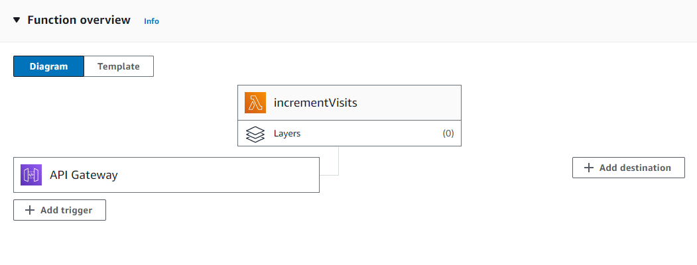
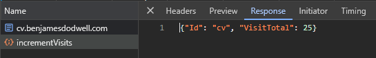

The next task of the challenge is to add a visitor counter to the website. While there are better solutions, such as [Google Analytics](https://marketingplatform.google.com/intl/en_uk/about/analytics/), this task allows me to create back-end infrastructure and introduce more AWS services. I feel that this task comes with a level of flexibility and opportunity to be creative, but I will start simple and meet the basic requirements then potentially make improvements in the future.

The first step is to provision a database, and the challenge recommends [Amazon DynamoDB](https://docs.aws.amazon.com/amazondynamodb/latest/developerguide/Introduction.html) with on-demand billing, a fully managed NoSQL database service. While I briefly covered document database types and used MongoDB during a university course, I am more familiar with relational databases so there will be a learning curve. The main difference to be aware of, seems to be that tables are schemaless other than the primary key; this means that you do not need to use the same attributes for every row or item, in fact you can add or omit attributes at-will for each item. 

I created a table named Visits with a primary key named Id that accepts a String data type. I intend to later create an item with an additional attribute named VisitTotal (COUNT and TOTAL are protected keywords) which accepts a Number data type.

Next up we need a way to interact with the database so that we can increment the VisitTotal value. For this, we are going to use [AWS Lambda](https://aws.amazon.com/lambda/) which is a serverless compute service so we don't need to manage any virtual machines and we're only paying for the compute time used when our code executes. There are several different runtime options with Lambda including .NET, Java, Node.js, Python, and Ruby. 

Getting familiar with Lambda involved some trial and error, as I had to understand the service itself, refresh my Python knowledge, and refer to the [Boto3 documentation](https://boto3.amazonaws.com/v1/documentation/api/latest/index.html). AWS provide a decent number of blueprints that help with examples, and once again the integrations with other AWS services make life much easier. 

The initial Python code for my Lambda function is:
```python
import boto3
import simplejson as json

table = boto3.resource('dynamodb').Table('Visits')

def lambda_handler(event, context):   
    response = table.update_item(
        Key={
            'Id': 'cv'
        },
        UpdateExpression='ADD VisitTotal :inc',
        ExpressionAttributeValues={
            ':inc': 1
        }
    )

    response = table.get_item(
        Key={
            'Id': 'cv'
        }
    )
    
    return {
        'statusCode': 200,
        'headers': {
            'Content-Type': 'application/json'
        },
        'body': json.dumps(response['Item'])
    }
```

This can be improved upon by adding error handling and tests, but it meets the basic requirements for now. I encountered some issues later where the native Lambda tests were successful, but via the API Gateway I was receiving a HTTP 500 status code and "Internal server error" message. This turned out to be that the 'body' response needs to be a String data type, which is why I introduced the json.dumps() function to convert the objects to String. However, the function in the standard json library seems to [lack support](https://bugs.python.org/issue16535) for the Decimal data type but is fixed by using [simplejson](https://pypi.org/project/simplejson/).

Permissions over the Lambda functions and other resources are all managed by policies and roles. Creating a Lambda function gives the option of automatically creating a role with the basic permissions required including for CloudWatch logs. I did need to add the following to the role, to allow it to access my DynamoDB table.

```json
{
    "Effect": "Allow",
    "Action": [
        "dynamodb:UpdateItem",
        "dynamodb:GetItem"
    ],
    "Resource": "arn:aws:dynamodb:eu-west-2:############:table/Visits"
}
```

Now we need a way for a website to trigger the Lambda function and the challenge suggests using an [API Gateway](https://aws.amazon.com/api-gateway/). While I will follow this approach, I did notice that it is possible to create a function URL on the Lambda function itself. Both accomplish the same basic functionality, but it seems that an API Gateway supports more features particularly around API types, authentication types, security, and logging.

The integrations in the AWS console shine through again, as you can either create an API Gateway and add an integration to the Lambda function, or you can add a trigger the the Lambda function and choose to create a new API Gateway.



Since my function is very simple with a singular purpose, I opted for an HTTP API type rather than REST API. I've also selected open security as there won't be any type of authentication required to view my CV website so I will consider the API be public too. Another configuration I've applied to the API gateway is for Cross-origin resource sharing (CORS), allowing the API to be called from a different domain.


Finally, a little addition to my placeholder index.html file to call the API:
```html
<script type="text/javascript">
async function incrementVisits() {
    const response = await fetch("https://abcdef.execute-api.eu-west-2.amazonaws.com/default/incrementVisits");
    const output = await response.json();
    console.log(output);
}

incrementVisits();    
</script>
```

Since we're using CloudFront, it's important to note that changes made to the S3 static website may not immediately reflect, as the cached version might be served for a while. To force the update, we can [invalidate the cache](https://docs.aws.amazon.com/AmazonCloudFront/latest/DeveloperGuide/Invalidation.html).

Now we have a working visit counter:

