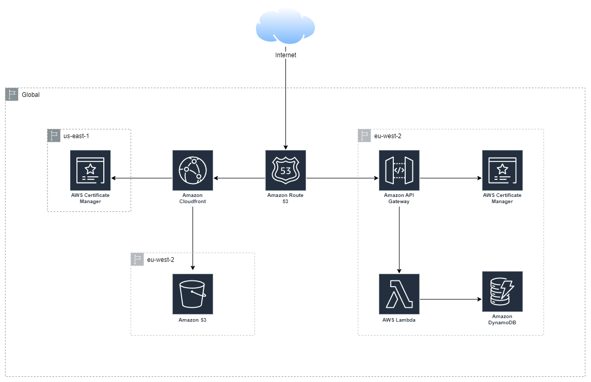

I'll briefly start by mentioning the fact that I've migrated this blog from GitHub Pages to AWS, using mostly the same services and techniques that I've covered throughout the Cloud Resume Challenge. My motivation was that I felt I'd have more control when hosting in AWS over GitHub Pages if I should decide to grow the site in future, and it also served as good practice. I think it is testament to the techniques learned throughout this challenge, as to how quickly and easily I was able to perform the migration by adapting and reusing the Terraform configurations and GitHub actions workflows.

The Cloud Resume Challenge has genuinely been an enjoyable and valuable experience. 

I've gained experience with the following AWS services:
- Identity and Access Management (IAM)
- Simple Storage Service (S3)
- Route 53
- CloudFront
- AWS Certificate Manager (ACM)
- DynamoDB
- Lambda
- API Gateway

The AWS architecture diagram below represents my frontend and backend infrastructure:

I've written Python code with unit tests for Lambda functions, practised Infrastructure as Code (IaC) with Terraform and the AWS provider, created Continuous Integration and Continuous Deployment (CI/CD) pipelines with GitHub Actions, and developed my CV with HTML, CSS, and JavaScript.

There are improvements that I could make, as an extension of this challenge, that I may attempt in the future. For example, I should write some Terraform tests and incorporate them into the Continuous Integration workflow. I could also make my Terraform configurations more reusable in places by using input variables, rather than hard-coding values such as S3 bucket names. 

I also acknowledge that while there was educational value in creating a backend with Lambda and the API Gateway, the visitor count functionality is not truly necessary. I would like to replace this with something that provides real value, such as utilising a Web Application Firewall (WAF) and [automatically updating rules](https://aws.amazon.com/blogs/security/automatically-updating-aws-waf-rule-in-real-time-using-amazon-eventbridge/).

The fact that there are opportunities to revise and improve again shows the value of the Cloud Resume Challenge to me as a project for professional development, and I will certainly be recommending it to colleagues in the future.

The repositories I've created are currently public, please find them below if they are useful in any way:
- [Terraform Backend Configuration](https://github.com/ben-james-dodwell/terraform-backend-s3-dynamodb)
- [GitHub Identity Provider Configuration](https://github.com/ben-james-dodwell/github-identity-provider)
- [CV Backend Infrastructure](https://github.com/ben-james-dodwell/backend-cv-benjamesdodwell-com)
- [CV Frontend Infrastructure](https://github.com/ben-james-dodwell/frontend-cv-benjamesdodwell-com)
- [Blog Infrastructure](https://github.com/ben-james-dodwell/blog-cv-benjamesdodwell-com)

And, once more, the final product:

**https://cv.benjamesdodwell.com**